Prediction\_of\_Survivorship\_of\_Heart\_Failure\_Patients
================
Yucong Gao
3/23/2022

read data

``` r
library(tidyverse)
```

    ## Warning: package 'tidyr' was built under R version 4.1.2

    ## Warning: package 'dplyr' was built under R version 4.1.2

``` r
library(caret)
library(glmnet)
library(pROC)
library(pdp)
library(vip)
library(AppliedPredictiveModeling)
library(klaR)
```

    ## Warning: package 'klaR' was built under R version 4.1.2

``` r
library(patchwork)
library(ranger)
library(gbm)
library(kernlab)
```

    ## Warning: package 'kernlab' was built under R version 4.1.2

``` r
heart = read.csv("./heart_failure_clinical_records_dataset.csv") %>% janitor::clean_names()

heart$anaemia = as.factor(heart$anaemia)
heart$diabetes = as.factor(heart$diabetes)
heart$high_blood_pressure = as.factor(heart$high_blood_pressure)
heart$sex = as.factor(heart$sex)
heart$smoking = as.factor(heart$smoking)
heart$death_event = as.factor(heart$death_event)

col_cont = c("age", "creatinine_phosphokinase", "ejection_fraction", "platelets", "serum_creatinine", "serum_sodium", "time", "death_event")
col_di = c("anaemia", "diabetes", "high_blood_pressure", "sex", "smoking", "death_event")
continuous = heart[, col_cont]
  

dichotomous = heart[, col_di]
dichotomous$death_event = factor(ifelse(dichotomous$death_event == 1, "dead", "alive"))
```

## EDA

``` r
theme1 <- transparentTheme(trans = .4)
trellis.par.set(theme1)

# univariable EDA
featurePlot(x = continuous[, 1:7], 
            y = continuous$death_event,
            scales = list(x = list(relation = "free"), 
                          y = list(relation = "free")),
            plot = "density", pch = "|", 
            auto.key = list(columns = 2))
```

<!-- -->

``` r
janitor::tabyl(dichotomous, anaemia, death_event) %>% knitr::kable()
```

| anaemia | alive | dead |
|:--------|------:|-----:|
| 0       |   120 |   50 |
| 1       |    83 |   46 |

``` r
janitor::tabyl(dichotomous, diabetes, death_event) %>% knitr::kable()
```

| diabetes | alive | dead |
|:---------|------:|-----:|
| 0        |   118 |   56 |
| 1        |    85 |   40 |

``` r
janitor::tabyl(dichotomous, high_blood_pressure, death_event) %>% knitr::kable()
```

| high\_blood\_pressure | alive | dead |
|:----------------------|------:|-----:|
| 0                     |   137 |   57 |
| 1                     |    66 |   39 |

``` r
janitor::tabyl(dichotomous, sex, death_event) %>% knitr::kable()
```

| sex | alive | dead |
|:----|------:|-----:|
| 0   |    71 |   34 |
| 1   |   132 |   62 |

``` r
janitor::tabyl(dichotomous, smoking, death_event) %>% knitr::kable()
```

| smoking | alive | dead |
|:--------|------:|-----:|
| 0       |   137 |   66 |
| 1       |    66 |   30 |

``` r
heart_tb = as.tibble(heart)

#anaemia
anaemia = 
  heart_tb %>% 
  group_by(death_event, anaemia) %>% 
  summarise(count = n()) %>% 
  ggplot(aes(x = anaemia, y = count, fill = death_event)) + 
  geom_bar(stat = "identity", position = 'dodge', alpha = .7) + 
  scale_x_discrete(labels = c("no anaemia", "have anaemia"))
```

    ## `summarise()` has grouped output by 'death_event'. You can override using the
    ## `.groups` argument.

``` r
anaemia_df = 
  heart_tb %>% 
  group_by(death_event, anaemia) %>% 
  summarise(count = n()) %>% 
  pivot_wider(values_from = count, 
              names_from = anaemia)
```

    ## `summarise()` has grouped output by 'death_event'. You can override using the
    ## `.groups` argument.

``` r
anamenia_odds = (anaemia_df[1,2] * anaemia_df[2,3]) / (anaemia_df[1,3]*anaemia_df[2,2])

# diabetes
diabetes = 
  heart_tb %>% 
  group_by(death_event, diabetes) %>% 
  summarise(count = n()) %>% 
  ggplot(aes(x = diabetes, y = count, fill = death_event)) + 
  geom_bar(stat = "identity", position = 'dodge', alpha = .7) + 
  scale_x_discrete(labels = c("no diabetes", "have diabetes"))
```

    ## `summarise()` has grouped output by 'death_event'. You can override using the
    ## `.groups` argument.

``` r
diabetes_df = 
  heart_tb %>% 
  group_by(death_event, diabetes) %>% 
  summarise(count = n()) %>% 
  pivot_wider(values_from = count, 
              names_from = diabetes)
```

    ## `summarise()` has grouped output by 'death_event'. You can override using the
    ## `.groups` argument.

``` r
diabetes_odds = (diabetes_df[1,2] * diabetes_df[2,3]) / (diabetes_df[1,3]*diabetes_df[2,2])


#high blood pressure
high_bp = 
  heart_tb %>% 
  group_by(death_event, high_blood_pressure) %>% 
  summarise(count = n()) %>% 
  ggplot(aes(x = high_blood_pressure, y = count, fill = death_event)) + 
  geom_bar(stat = "identity", position = 'dodge', alpha = .7) + 
  scale_x_discrete(labels = c("no high bp", "have high bp"))
```

    ## `summarise()` has grouped output by 'death_event'. You can override using the
    ## `.groups` argument.

``` r
high_blood_pressure_df = 
  heart_tb %>% 
  group_by(death_event, high_blood_pressure) %>% 
  summarise(count = n()) %>% 
  pivot_wider(values_from = count, 
              names_from = high_blood_pressure)
```

    ## `summarise()` has grouped output by 'death_event'. You can override using the
    ## `.groups` argument.

``` r
high_bp_odds = (high_blood_pressure_df[1,2] * high_blood_pressure_df[2,3]) / (high_blood_pressure_df[1,3]*high_blood_pressure_df[2,2])


sex = 
  heart_tb %>% 
  group_by(death_event, sex) %>% 
  summarise(count = n()) %>% 
  ggplot(aes(x = sex, y = count, fill = death_event)) + 
  geom_bar(stat = "identity", position = 'dodge', alpha = .7) + 
  scale_x_discrete(labels = c("female", "male"))
```

    ## `summarise()` has grouped output by 'death_event'. You can override using the
    ## `.groups` argument.

``` r
sex_df = 
  heart_tb %>% 
  group_by(death_event, sex) %>% 
  summarise(count = n()) %>% 
  pivot_wider(values_from = count, 
              names_from = sex)
```

    ## `summarise()` has grouped output by 'death_event'. You can override using the
    ## `.groups` argument.

``` r
sex_odds = (sex_df[1,2] * sex_df[2,3]) / (sex_df[1,3]*sex_df[2,2])

smoking = 
  heart_tb %>% 
  group_by(death_event, smoking) %>% 
  summarise(count = n()) %>% 
  ggplot(aes(x = smoking, y = count, fill = death_event)) + 
  geom_bar(stat = "identity", position = 'dodge', alpha = .7) + 
  scale_x_discrete(labels = c("no smoking", "smoking"))
```

    ## `summarise()` has grouped output by 'death_event'. You can override using the
    ## `.groups` argument.

``` r
smoking_df = 
  heart_tb %>% 
  group_by(death_event, smoking) %>% 
  summarise(count = n()) %>% 
  pivot_wider(values_from = count, 
              names_from = smoking)
```

    ## `summarise()` has grouped output by 'death_event'. You can override using the
    ## `.groups` argument.

``` r
smoking_odds = (smoking_df[1,2] * smoking_df[2,3]) / (smoking_df[1,3]*smoking_df[2,2])


(anaemia + diabetes + high_bp) / (sex + smoking)
```

<!-- -->

``` r
attributes = c("anaemia", "diabetes", "high blood pressure", "sex", "smoking")
odds = c(as.numeric(anamenia_odds), 
         as.numeric(diabetes_odds), 
         as.numeric(high_bp_odds), 
         as.numeric(sex_odds), 
         as.numeric(smoking_odds))

tibble(variable = attributes,odds =  odds) %>% knitr::kable()
```

| variable            |      odds |
|:--------------------|----------:|
| anaemia             | 1.3301205 |
| diabetes            | 0.9915966 |
| high blood pressure | 1.4202552 |
| sex                 | 0.9808378 |
| smoking             | 0.9435262 |

``` r
cp_time = heart_tb %>% 
  ggplot(aes(x = time, y = creatinine_phosphokinase, color = death_event)) + 
  geom_point()


ef_time = heart_tb %>% 
  ggplot(aes(x = time, y = ejection_fraction, color = death_event)) + 
  geom_point()

pltlt_time = heart_tb %>% 
  ggplot(aes(x = time, y = platelets, color = death_event)) + 
  geom_point()


sc_time = heart_tb %>% 
  ggplot(aes(x = time, y = serum_creatinine, color = death_event)) + 
  geom_point()


ss_time = heart_tb %>% 
  ggplot(aes(x = time, y = serum_sodium, color = death_event)) + 
  geom_point()

(cp_time + ef_time) / (pltlt_time +sc_time )
```

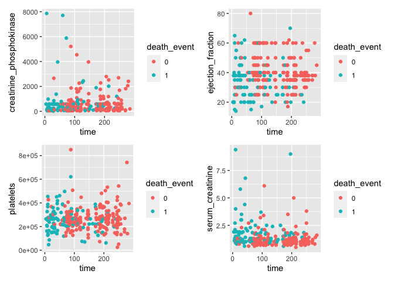<!-- -->

``` r
ss_time 
```

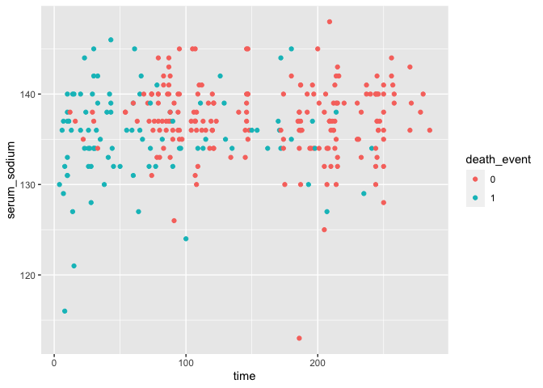<!-- -->

## Modeling

### Prepare the data

``` r
heart = heart[,-12]
heart$creatinine_phosphokinase = as.numeric(heart$creatinine_phosphokinase)
heart$ejection_fraction = as.numeric(heart$ejection_fraction)
heart$serum_sodium = as.numeric(heart$serum_sodium)
heart$death_event = factor(ifelse(heart$death_event == 1, "dead", "alive"))

set.seed(1)
rowtr = createDataPartition(heart$death_event, 
                            p = .75, 
                            list = F)

x = model.matrix(death_event~., heart)[,-1]
y = heart$death_event


ctrl_1 = trainControl(method = "cv", 
                    summaryFunction = twoClassSummary, 
                    classProbs = T)

# use accuracy and kappa as the evaluation metrics
ctrl_2 = trainControl(method = "cv")
```

### Logistic Regression

``` r
set.seed(1)
logit_fit = train(x[rowtr,], y[rowtr], 
                  method = "glm", 
                  metric = "Accuracy", 
                  trControl = ctrl_1)

summary(logit_fit)
```

    ## 
    ## Call:
    ## NULL
    ## 
    ## Deviance Residuals: 
    ##     Min       1Q   Median       3Q      Max  
    ## -1.9103  -0.8122  -0.5171   0.8674   2.3832  
    ## 
    ## Coefficients:
    ##                            Estimate Std. Error z value Pr(>|z|)    
    ## (Intercept)               5.134e+00  4.994e+00   1.028 0.303916    
    ## age                       5.098e-02  1.492e-02   3.418 0.000632 ***
    ## anaemia1                  4.142e-01  3.367e-01   1.230 0.218607    
    ## creatinine_phosphokinase  2.924e-04  1.551e-04   1.885 0.059461 .  
    ## diabetes1                -1.392e-01  3.381e-01  -0.412 0.680444    
    ## ejection_fraction        -5.977e-02  1.609e-02  -3.714 0.000204 ***
    ## high_blood_pressure1      1.899e-01  3.417e-01   0.556 0.578334    
    ## platelets                -5.102e-07  1.740e-06  -0.293 0.769324    
    ## serum_creatinine          5.873e-01  2.021e-01   2.906 0.003660 ** 
    ## serum_sodium             -5.544e-02  3.590e-02  -1.544 0.122497    
    ## sex1                     -6.385e-01  3.961e-01  -1.612 0.106935    
    ## smoking1                  1.909e-01  3.953e-01   0.483 0.629138    
    ## ---
    ## Signif. codes:  0 '***' 0.001 '**' 0.01 '*' 0.05 '.' 0.1 ' ' 1
    ## 
    ## (Dispersion parameter for binomial family taken to be 1)
    ## 
    ##     Null deviance: 282.09  on 224  degrees of freedom
    ## Residual deviance: 231.52  on 213  degrees of freedom
    ## AIC: 255.52
    ## 
    ## Number of Fisher Scoring iterations: 4

``` r
logit_pred_prob = predict(logit_fit, newdata = x[-rowtr,], type = "prob")[,2]
logit_pred = rep("dead", length(logit_pred_prob))
logit_pred[logit_pred_prob<0.5] = "alive"

#confusion matrix
confusionMatrix(data = as.factor(logit_pred),
                reference = y[-rowtr], 
                positive = "dead")
```

    ## Confusion Matrix and Statistics
    ## 
    ##           Reference
    ## Prediction alive dead
    ##      alive    46   12
    ##      dead      4   12
    ##                                           
    ##                Accuracy : 0.7838          
    ##                  95% CI : (0.6728, 0.8711)
    ##     No Information Rate : 0.6757          
    ##     P-Value [Acc > NIR] : 0.02819         
    ##                                           
    ##                   Kappa : 0.4599          
    ##                                           
    ##  Mcnemar's Test P-Value : 0.08012         
    ##                                           
    ##             Sensitivity : 0.5000          
    ##             Specificity : 0.9200          
    ##          Pos Pred Value : 0.7500          
    ##          Neg Pred Value : 0.7931          
    ##              Prevalence : 0.3243          
    ##          Detection Rate : 0.1622          
    ##    Detection Prevalence : 0.2162          
    ##       Balanced Accuracy : 0.7100          
    ##                                           
    ##        'Positive' Class : dead            
    ## 

``` r
#ROC curve
logit_roc = roc(y[-rowtr], logit_pred_prob)
```

    ## Setting levels: control = alive, case = dead

    ## Setting direction: controls < cases

``` r
plot(logit_roc, legacy.axes = T, print.auc = T)
plot(smooth(logit_roc), col = 4 , add = T)
```

<!-- -->

``` r
# variable importance
vip(logit_fit)
```

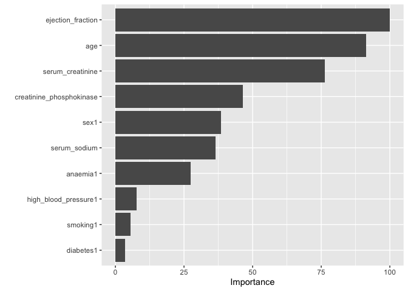<!-- -->

``` r
# for resample to compare model
set.seed(1)
logit_fit_1 = train(x[rowtr,], y[rowtr], 
                  method = "glm", 
                  metric = "Accuracy", 
                  trControl = ctrl_2)
```

### Penalized Logistic Regression

``` r
glmnGrid = expand.grid(.alpha = seq(0, 1, length = 21), 
                       .lambda = exp(seq(-6, 5, length = 80)))


set.seed(1)
glmnet_fit = train(x[rowtr, ], y[rowtr],
                method = "glmnet",
                metric = "Accuracy", 
                tuneGrid = glmnGrid, 
                trControl = ctrl_1)

glmnet_fit$bestTune
```

    ##     alpha    lambda
    ## 108  0.05 0.1064046

``` r
# plot tuning parameters
myCol<- rainbow(25)
myPar <- list(superpose.symbol = list(col = myCol),
              superpose.line = list(col = myCol))

plot(glmnet_fit, par.settings = myPar, xTrans = function(x) log(x))
```

<!-- -->

``` r
# roc curve
glmnet_pred_prob = predict(glmnet_fit, x[-rowtr, ], type = "prob")[,2]

glmnet_roc = roc(y[-rowtr], glmnet_pred_prob)
```

    ## Setting levels: control = alive, case = dead

    ## Setting direction: controls < cases

``` r
plot(glmnet_roc, legacy.axes = T, print.auc = T)
plot(smooth(glmnet_roc), col = 4 , add = T)
```

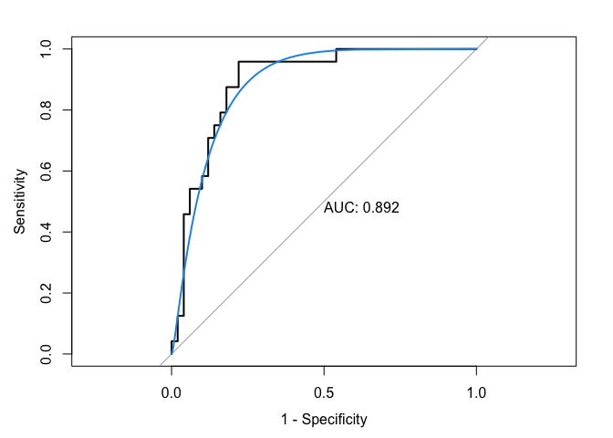<!-- -->

``` r
vip(glmnet_fit)
```

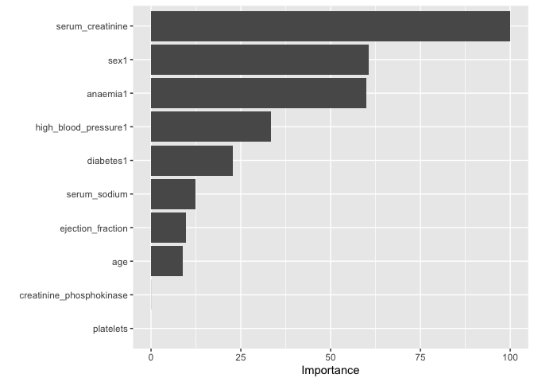<!-- -->

``` r
coef(glmnet_fit$finalModel, glmnet_fit$bestTune$lambda)
```

    ## 12 x 1 sparse Matrix of class "dgCMatrix"
    ##                                     s1
    ## (Intercept)               3.512969e+00
    ## age                       2.772608e-02
    ## anaemia1                  1.877867e-01
    ## creatinine_phosphokinase  1.255719e-04
    ## diabetes1                -7.111462e-02
    ## ejection_fraction        -3.021348e-02
    ## high_blood_pressure1      1.044099e-01
    ## platelets                -8.728370e-08
    ## serum_creatinine          3.129451e-01
    ## serum_sodium             -3.884298e-02
    ## sex1                     -1.897945e-01
    ## smoking1                  .

``` r
# confusion matrix
glmnet_pred = rep("dead", length(glmnet_pred_prob))
glmnet_pred[glmnet_pred_prob<0.5] = "alive"
confusionMatrix(data = as.factor(glmnet_pred),
                reference = y[-rowtr], 
                positive = "dead")
```

    ## Confusion Matrix and Statistics
    ## 
    ##           Reference
    ## Prediction alive dead
    ##      alive    48   17
    ##      dead      2    7
    ##                                           
    ##                Accuracy : 0.7432          
    ##                  95% CI : (0.6284, 0.8378)
    ##     No Information Rate : 0.6757          
    ##     P-Value [Acc > NIR] : 0.130953        
    ##                                           
    ##                   Kappa : 0.3005          
    ##                                           
    ##  Mcnemar's Test P-Value : 0.001319        
    ##                                           
    ##             Sensitivity : 0.29167         
    ##             Specificity : 0.96000         
    ##          Pos Pred Value : 0.77778         
    ##          Neg Pred Value : 0.73846         
    ##              Prevalence : 0.32432         
    ##          Detection Rate : 0.09459         
    ##    Detection Prevalence : 0.12162         
    ##       Balanced Accuracy : 0.62583         
    ##                                           
    ##        'Positive' Class : dead            
    ## 

``` r
# for model comparison
set.seed(1)
glmnet_fit_2 = train(x[rowtr, ], y[rowtr],
                method = "glmnet",
                metric = "Accuracy", 
                tuneGrid = glmnGrid, 
                trControl = ctrl_2)
```

### GAM

``` r
set.seed(1)
gam_fit = train(x[rowtr,],
                y[rowtr],
                   method = "gam",
                   metric = "Accuracy",
                   trControl = ctrl_1)
```

    ## Loading required package: mgcv

    ## Loading required package: nlme

    ## 
    ## Attaching package: 'nlme'

    ## The following object is masked from 'package:dplyr':
    ## 
    ##     collapse

    ## This is mgcv 1.8-38. For overview type 'help("mgcv-package")'.

``` r
gam_fit$finalModel
```

    ## 
    ## Family: binomial 
    ## Link function: logit 
    ## 
    ## Formula:
    ## .outcome ~ anaemia1 + diabetes1 + high_blood_pressure1 + sex1 + 
    ##     smoking1 + s(ejection_fraction) + s(serum_sodium) + s(serum_creatinine) + 
    ##     s(age) + s(platelets) + s(creatinine_phosphokinase)
    ## 
    ## Estimated degrees of freedom:
    ## 2.28 1.00 2.61 1.95 3.14 2.01  total = 18.99 
    ## 
    ## UBRE score: 0.07894595

``` r
gam_pred_prob = predict(gam_fit, x[-rowtr,], type = "prob")[,2]

# roc curve
gam_roc = roc(y[-rowtr], gam_pred_prob)
```

    ## Setting levels: control = alive, case = dead

    ## Setting direction: controls < cases

``` r
plot(gam_roc, legacy.axes = T, print.auc = T)
plot(smooth(gam_roc), col = 4 , add = T)
```

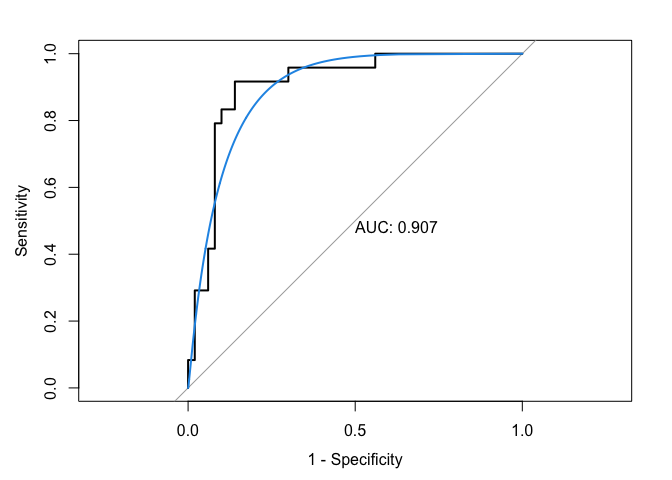<!-- -->

``` r
#confusion matrix
gam_pred = rep("dead", length(gam_pred_prob))
gam_pred[gam_pred_prob<0.5] = "alive"
confusionMatrix(data = as.factor(gam_pred),
                reference = y[-rowtr], 
                positive = "dead")
```

    ## Confusion Matrix and Statistics
    ## 
    ##           Reference
    ## Prediction alive dead
    ##      alive    46    9
    ##      dead      4   15
    ##                                          
    ##                Accuracy : 0.8243         
    ##                  95% CI : (0.7183, 0.903)
    ##     No Information Rate : 0.6757         
    ##     P-Value [Acc > NIR] : 0.003213       
    ##                                          
    ##                   Kappa : 0.5762         
    ##                                          
    ##  Mcnemar's Test P-Value : 0.267257       
    ##                                          
    ##             Sensitivity : 0.6250         
    ##             Specificity : 0.9200         
    ##          Pos Pred Value : 0.7895         
    ##          Neg Pred Value : 0.8364         
    ##              Prevalence : 0.3243         
    ##          Detection Rate : 0.2027         
    ##    Detection Prevalence : 0.2568         
    ##       Balanced Accuracy : 0.7725         
    ##                                          
    ##        'Positive' Class : dead           
    ## 

``` r
vip(gam_fit)
```

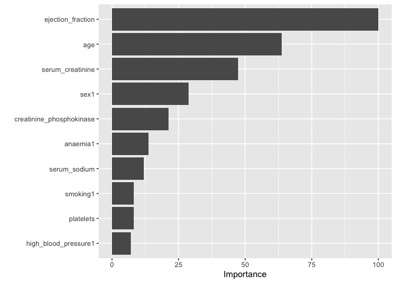<!-- -->

### MARS

``` r
set.seed(1)
mars_fit = train(x[rowtr,], 
                 y[rowtr],
                 method = "earth",
                 metric = "Accuracy", 
                 tuneGrid = expand.grid(degree = 1:3, 
                                        nprune = 2:30), 
                 trControl = ctrl_1)
```

    ## Loading required package: earth

    ## Loading required package: Formula

    ## Loading required package: plotmo

    ## Loading required package: plotrix

    ## Loading required package: TeachingDemos

    ## 
    ## Attaching package: 'TeachingDemos'

    ## The following object is masked from 'package:klaR':
    ## 
    ##     triplot

``` r
plot(mars_fit)
```

<!-- -->

``` r
mars_fit$bestTune
```

    ##    nprune degree
    ## 33      5      2

``` r
summary(mars_fit)
```

    ## Call: earth(x=matrix[225,11], y=factor.object, keepxy=TRUE,
    ##             glm=list(family=function.object, maxit=100), degree=2, nprune=5)
    ## 
    ## GLM coefficients
    ##                                dead
    ## (Intercept)              -0.4973352
    ## h(age-75)                 0.2148458
    ## h(35-ejection_fraction)   0.1574569
    ## h(1.83-serum_creatinine) -1.6702641
    ## h(serum_creatinine-1.83)  0.1743615
    ## 
    ## GLM (family binomial, link logit):
    ##  nulldev  df       dev  df   devratio     AIC iters converged
    ##  282.091 224   219.906 220       0.22   229.9     4         1
    ## 
    ## Earth selected 5 of 18 terms, and 3 of 11 predictors (nprune=5)
    ## Termination condition: Reached nk 23
    ## Importance: ejection_fraction, age, serum_creatinine, anaemia1-unused, ...
    ## Number of terms at each degree of interaction: 1 4 (additive model)
    ## Earth GCV 0.1765461    RSS 35.9338    GRSq 0.1958626    RSq 0.266058

``` r
# confusion matrix
mars_pred_prob = predict(mars_fit, newdata = x[-rowtr, ], type = "prob")[,2]
mars_pred = rep("dead", length(mars_pred_prob))
mars_pred[mars_pred_prob<0.5] = "alive"
confusionMatrix(data = as.factor(mars_pred), 
                reference = y[-rowtr], 
                positive = "dead")
```

    ## Confusion Matrix and Statistics
    ## 
    ##           Reference
    ## Prediction alive dead
    ##      alive    45   10
    ##      dead      5   14
    ##                                           
    ##                Accuracy : 0.7973          
    ##                  95% CI : (0.6878, 0.8819)
    ##     No Information Rate : 0.6757          
    ##     P-Value [Acc > NIR] : 0.01476         
    ##                                           
    ##                   Kappa : 0.511           
    ##                                           
    ##  Mcnemar's Test P-Value : 0.30170         
    ##                                           
    ##             Sensitivity : 0.5833          
    ##             Specificity : 0.9000          
    ##          Pos Pred Value : 0.7368          
    ##          Neg Pred Value : 0.8182          
    ##              Prevalence : 0.3243          
    ##          Detection Rate : 0.1892          
    ##    Detection Prevalence : 0.2568          
    ##       Balanced Accuracy : 0.7417          
    ##                                           
    ##        'Positive' Class : dead            
    ## 

``` r
# roc curve
mars_roc = roc(y[-rowtr], mars_pred_prob)
```

    ## Setting levels: control = alive, case = dead

    ## Setting direction: controls < cases

``` r
plot(mars_roc, legacy.axes = T, print.auc = T)
plot(smooth(mars_roc), col = 4 , add = T)
```

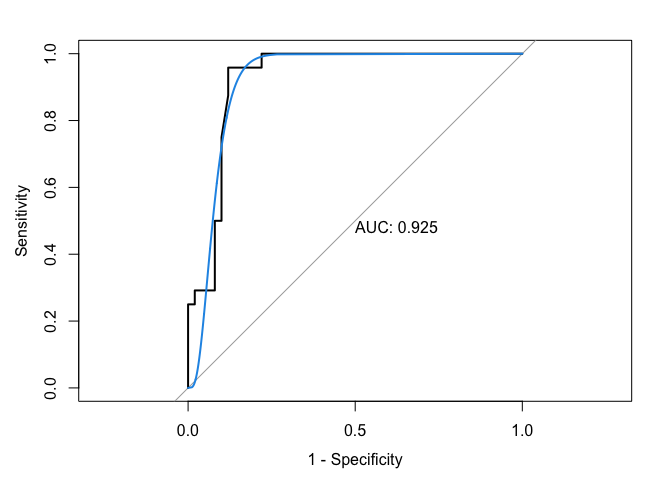<!-- -->

``` r
# variable importance
vip(mars_fit$finalModel)
```

<!-- -->

``` r
mars_fit$finalModel
```

    ## GLM (family binomial, link logit):
    ##  nulldev  df       dev  df   devratio     AIC iters converged
    ##  282.091 224   219.906 220       0.22   229.9     4         1
    ## 
    ## Earth selected 5 of 18 terms, and 3 of 11 predictors (nprune=5)
    ## Termination condition: Reached nk 23
    ## Importance: ejection_fraction, age, serum_creatinine, anaemia1-unused, ...
    ## Number of terms at each degree of interaction: 1 4 (additive model)
    ## Earth GCV 0.1765461    RSS 35.9338    GRSq 0.1958626    RSq 0.266058

pdp plot

``` r
pdp::partial(mars_fit, pred.var = c("ejection_fraction"), grid.resolution = 100) %>% autoplot()
```

    ## Warning: Use of `object[[1L]]` is discouraged. Use `.data[[1L]]` instead.

    ## Warning: Use of `object[["yhat"]]` is discouraged. Use `.data[["yhat"]]`
    ## instead.

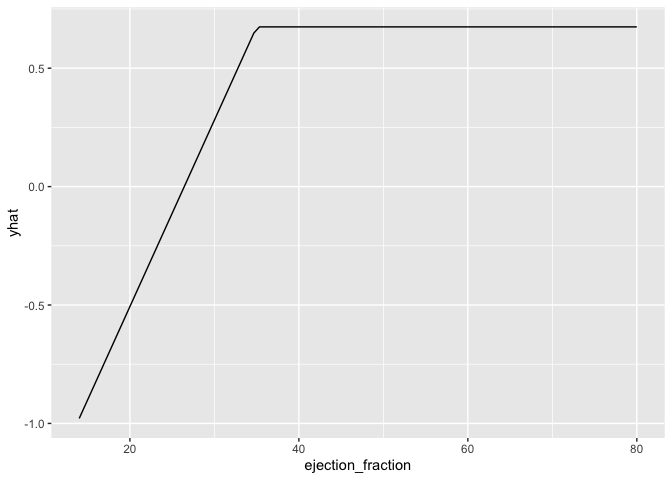<!-- -->

``` r
pdp::partial(mars_fit, 
             pred.var = c("ejection_fraction", "serum_creatinine", "age"), 
             grid.resolution = 10) %>% 
  pdp::plotPartial(levelplot = F, zlab = "yhat", drape = T, screen = list(z = 20, x = -60))
```

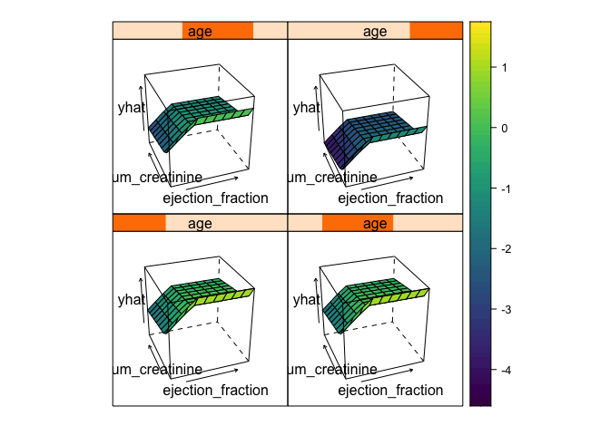<!-- -->

``` r
pdp::partial(mars_fit, pred.var = c("age"), grid.resolution = 10) %>% autoplot()
```

    ## Warning: Use of `object[[1L]]` is discouraged. Use `.data[[1L]]` instead.
    ## Use of `object[["yhat"]]` is discouraged. Use `.data[["yhat"]]` instead.

<!-- -->

``` r
pdp::partial(mars_fit, pred.var = c("serum_creatinine"), grid.resolution = 10) %>% autoplot()
```

    ## Warning: Use of `object[[1L]]` is discouraged. Use `.data[[1L]]` instead.
    ## Use of `object[["yhat"]]` is discouraged. Use `.data[["yhat"]]` instead.

<!-- -->

### LDA

``` r
set.seed(1)

lda_fit = train(x[rowtr, ], y[rowtr], 
                method = "lda", 
                metric = "Accuracy", 
                trControl = ctrl_1)


# confusion matrix
lda_pred_prob = predict(lda_fit, newdata = x[-rowtr, ], type = "prob")[,2]
lda_pred = rep("dead", length(lda_pred_prob))
lda_pred[lda_pred_prob<0.5] = "alive"
confusionMatrix(data = as.factor(lda_pred), 
                reference = y[-rowtr], 
                positive = "dead")
```

    ## Confusion Matrix and Statistics
    ## 
    ##           Reference
    ## Prediction alive dead
    ##      alive    46   13
    ##      dead      4   11
    ##                                           
    ##                Accuracy : 0.7703          
    ##                  95% CI : (0.6579, 0.8601)
    ##     No Information Rate : 0.6757          
    ##     P-Value [Acc > NIR] : 0.05019         
    ##                                           
    ##                   Kappa : 0.4192          
    ##                                           
    ##  Mcnemar's Test P-Value : 0.05235         
    ##                                           
    ##             Sensitivity : 0.4583          
    ##             Specificity : 0.9200          
    ##          Pos Pred Value : 0.7333          
    ##          Neg Pred Value : 0.7797          
    ##              Prevalence : 0.3243          
    ##          Detection Rate : 0.1486          
    ##    Detection Prevalence : 0.2027          
    ##       Balanced Accuracy : 0.6892          
    ##                                           
    ##        'Positive' Class : dead            
    ## 

``` r
# roc curve
lda_roc = roc(y[-rowtr], lda_pred_prob)
```

    ## Setting levels: control = alive, case = dead

    ## Setting direction: controls < cases

``` r
plot(lda_roc, legacy.axes = T, print.auc = T)
plot(smooth(lda_roc), col = 4 , add = T)
```

<!-- -->

``` r
# plot discriminant variable
set.seed(1)
lda_fit2 = lda(death_event~., data = heart, 
               subset = rowtr)
plot(lda_fit2)
```

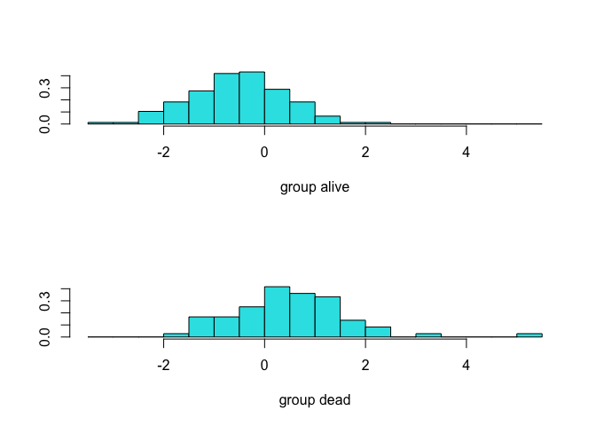<!-- -->

### Naive Bayes

``` r
nbgrid = expand.grid(usekernel = c(F, T),
                     fL = 1,
                     adjust = seq(.2, 3,by = .2))

set.seed(1)
nb_fit = train(x[rowtr, ], y[rowtr], 
               method = "nb", 
               tuneGrid = nbgrid,
               metric = "Accuracy", 
               trControl = ctrl_1)

plot(nb_fit)
```

<!-- -->

``` r
nb_fit$bestTune
```

    ##    fL usekernel adjust
    ## 20  1      TRUE      1

``` r
#confusion matrix
nb_pred_prob = predict(nb_fit, newdata = x[-rowtr, ], type = "prob")[,2]
nb_pred = rep("dead", length(nb_pred_prob))
nb_pred[nb_pred_prob<0.5] = "alive"
confusionMatrix(data = as.factor(nb_pred), 
                reference = y[-rowtr], 
                positive = "dead")
```

    ## Confusion Matrix and Statistics
    ## 
    ##           Reference
    ## Prediction alive dead
    ##      alive    46   15
    ##      dead      4    9
    ##                                           
    ##                Accuracy : 0.7432          
    ##                  95% CI : (0.6284, 0.8378)
    ##     No Information Rate : 0.6757          
    ##     P-Value [Acc > NIR] : 0.13095         
    ##                                           
    ##                   Kappa : 0.3349          
    ##                                           
    ##  Mcnemar's Test P-Value : 0.02178         
    ##                                           
    ##             Sensitivity : 0.3750          
    ##             Specificity : 0.9200          
    ##          Pos Pred Value : 0.6923          
    ##          Neg Pred Value : 0.7541          
    ##              Prevalence : 0.3243          
    ##          Detection Rate : 0.1216          
    ##    Detection Prevalence : 0.1757          
    ##       Balanced Accuracy : 0.6475          
    ##                                           
    ##        'Positive' Class : dead            
    ## 

``` r
#roc
nb_roc = roc(y[-rowtr], nb_pred_prob)
```

    ## Setting levels: control = alive, case = dead

    ## Setting direction: controls < cases

``` r
plot(nb_roc, legacy.axes = T, print.auc = T)
plot(smooth(nb_roc), col = 4 , add = T)
```

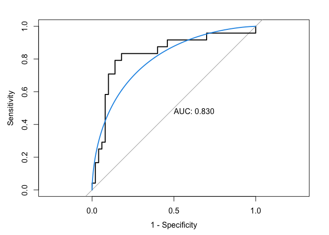<!-- -->

### Random Forest

``` r
rf.grid = expand.grid(mtry = 1:11, 
                      splitrule = "gini", 
                      min.node.size = seq(from = 1, to = 9, by = 2))

set.seed(1)
rf.fit = train(death_event~., 
               heart, 
               subset = rowtr, 
               method = "ranger", 
               tuneGrid = rf.grid, 
               metric = "Accuracy", 
               trControl = ctrl_1)
```

    ## Warning in train.default(x, y, weights = w, ...): The metric "Accuracy" was not
    ## in the result set. ROC will be used instead.

``` r
ggplot(rf.fit, highlight = T)
```

<!-- -->

``` r
rf.fit$bestTune
```

    ##   mtry splitrule min.node.size
    ## 1    1      gini             1

``` r
# Confusion Matrix
rf_pred_prob = predict(rf.fit, newdata = heart[-rowtr, ], type = "prob")[,2]
rf_pred = rep("dead", length(rf_pred_prob))
rf_pred[rf_pred_prob<0.5] = "alive"
confusionMatrix(data = as.factor(rf_pred), 
                reference = y[-rowtr], 
                positive = "dead")
```

    ## Confusion Matrix and Statistics
    ## 
    ##           Reference
    ## Prediction alive dead
    ##      alive    48   17
    ##      dead      2    7
    ##                                           
    ##                Accuracy : 0.7432          
    ##                  95% CI : (0.6284, 0.8378)
    ##     No Information Rate : 0.6757          
    ##     P-Value [Acc > NIR] : 0.130953        
    ##                                           
    ##                   Kappa : 0.3005          
    ##                                           
    ##  Mcnemar's Test P-Value : 0.001319        
    ##                                           
    ##             Sensitivity : 0.29167         
    ##             Specificity : 0.96000         
    ##          Pos Pred Value : 0.77778         
    ##          Neg Pred Value : 0.73846         
    ##              Prevalence : 0.32432         
    ##          Detection Rate : 0.09459         
    ##    Detection Prevalence : 0.12162         
    ##       Balanced Accuracy : 0.62583         
    ##                                           
    ##        'Positive' Class : dead            
    ## 

``` r
# roc
rf_roc = roc(y[-rowtr], rf_pred_prob)
```

    ## Setting levels: control = alive, case = dead

    ## Setting direction: controls < cases

``` r
plot(rf_roc, legacy.axes = T, print.auc = T)
plot(smooth(rf_roc), col = 4 , add = T)
```

<!-- -->

### AdaBoost

``` r
gbm.grid = expand.grid(n.trees = c(2000, 3000, 4000, 5000), 
                       interaction.depth = 1:7, 
                       shrinkage = c(0.0005, 0.001, 0.002, 0.003), 
                       n.minobsinnode = 1)

set.seed(1)
gbm.fit = train(death_event~., 
                heart, 
                subset = rowtr, 
                tuneGrid = gbm.grid, 
                trControl = ctrl_1, 
                method = "gbm", 
                distribution = "adaboost", 
                metric = "Accuracy", 
                verbose = F)
```

    ## Warning in train.default(x, y, weights = w, ...): The metric "Accuracy" was not
    ## in the result set. ROC will be used instead.

``` r
ggplot(gbm.fit, highlight = T)
```

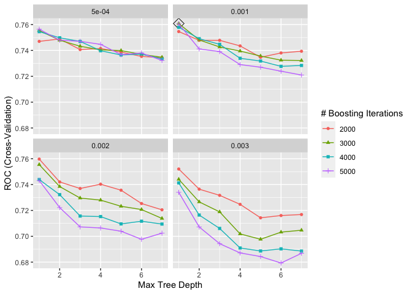<!-- -->

``` r
gbm.fit$bestTune
```

    ##    n.trees interaction.depth shrinkage n.minobsinnode
    ## 30    3000                 1     0.001              1

``` r
# Confusion Matrix
gbm_pred_prob = predict(gbm.fit, newdata = heart[-rowtr, ], type = "prob")[,2]
gbm_pred = rep("dead", length(gbm_pred_prob))
gbm_pred[gbm_pred_prob<0.5] = "alive"
confusionMatrix(data = as.factor(gbm_pred), 
                reference = y[-rowtr], 
                positive = "dead")
```

    ## Confusion Matrix and Statistics
    ## 
    ##           Reference
    ## Prediction alive dead
    ##      alive    46   16
    ##      dead      4    8
    ##                                           
    ##                Accuracy : 0.7297          
    ##                  95% CI : (0.6139, 0.8265)
    ##     No Information Rate : 0.6757          
    ##     P-Value [Acc > NIR] : 0.19341         
    ##                                           
    ##                   Kappa : 0.2912          
    ##                                           
    ##  Mcnemar's Test P-Value : 0.01391         
    ##                                           
    ##             Sensitivity : 0.3333          
    ##             Specificity : 0.9200          
    ##          Pos Pred Value : 0.6667          
    ##          Neg Pred Value : 0.7419          
    ##              Prevalence : 0.3243          
    ##          Detection Rate : 0.1081          
    ##    Detection Prevalence : 0.1622          
    ##       Balanced Accuracy : 0.6267          
    ##                                           
    ##        'Positive' Class : dead            
    ## 

``` r
gbm.fit$bestTune
```

    ##    n.trees interaction.depth shrinkage n.minobsinnode
    ## 30    3000                 1     0.001              1

``` r
# roc
gbm_roc = roc(y[-rowtr], gbm_pred_prob)
```

    ## Setting levels: control = alive, case = dead

    ## Setting direction: controls < cases

``` r
plot(gbm_roc, legacy.axes = T, print.auc = T)
plot(smooth(gbm_roc), col = 4 , add = T)
```

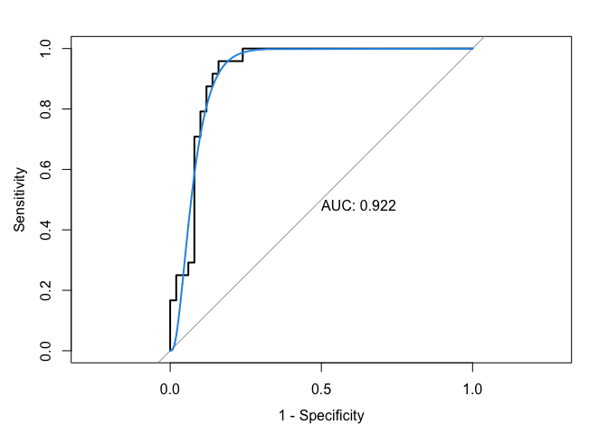<!-- -->

### SVM

#### Linear Kernel

``` r
ctrl_svm = trainControl(method = "cv")

set.seed(1)
svml_fit = train(death_event~., 
                 data = heart[rowtr,], 
                 method = "svmLinear", 
                 tuneGrid = data.frame(C = exp(seq(-6, 1, len = 70))), 
                 trControl = ctrl_svm)

plot(svml_fit, hightlight = T, xTrans = log)
```

<!-- -->

``` r
svml_fit$bestTune
```

    ##           C
    ## 68 2.219099

``` r
# test error
svml.pred = predict(svml_fit, newdata = heart[-rowtr,])

confusionMatrix(svml.pred, heart$death_event[-rowtr])
```

    ## Confusion Matrix and Statistics
    ## 
    ##           Reference
    ## Prediction alive dead
    ##      alive    46   13
    ##      dead      4   11
    ##                                           
    ##                Accuracy : 0.7703          
    ##                  95% CI : (0.6579, 0.8601)
    ##     No Information Rate : 0.6757          
    ##     P-Value [Acc > NIR] : 0.05019         
    ##                                           
    ##                   Kappa : 0.4192          
    ##                                           
    ##  Mcnemar's Test P-Value : 0.05235         
    ##                                           
    ##             Sensitivity : 0.9200          
    ##             Specificity : 0.4583          
    ##          Pos Pred Value : 0.7797          
    ##          Neg Pred Value : 0.7333          
    ##              Prevalence : 0.6757          
    ##          Detection Rate : 0.6216          
    ##    Detection Prevalence : 0.7973          
    ##       Balanced Accuracy : 0.6892          
    ##                                           
    ##        'Positive' Class : alive           
    ## 

#### Radial kernel

``` r
svmr.grid = expand.grid(C = exp(seq(-3, 2, len=25)), 
                        sigma = exp(seq(-7, -2, len = 25)))
set.seed(1)
svmr.fit = train(death_event~., heart[rowtr,], 
                 method = "svmRadialSigma", 
                 tuneGrid = svmr.grid, 
                 trControl = ctrl_svm)

myCol = rainbow(20)
myPar = list(superpose.symbol = list(col = myCol), 
             superpose.line = list(col = myCol))
plot(svmr.fit, highlight = T, par.settings = myPar)
```

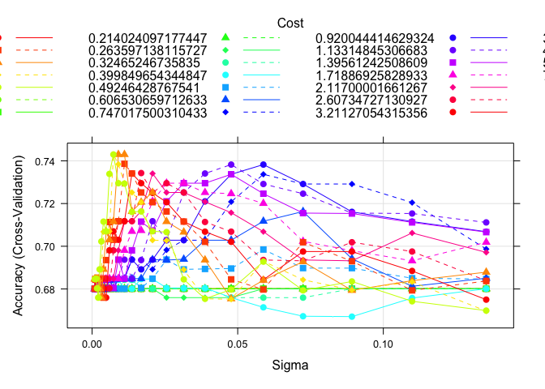<!-- -->

``` r
svmr.fit$bestTune
```

    ##        sigma        C
    ## 563 0.011109 4.871166

``` r
svmr.fit$finalModel
```

    ## Support Vector Machine object of class "ksvm" 
    ## 
    ## SV type: C-svc  (classification) 
    ##  parameter : cost C = 4.87116599924548 
    ## 
    ## Gaussian Radial Basis kernel function. 
    ##  Hyperparameter : sigma =  0.0111089965382423 
    ## 
    ## Number of Support Vectors : 142 
    ## 
    ## Objective Function Value : -597.9 
    ## Training error : 0.231111

``` r
svmr.pred = predict(svmr.fit, newdata = heart[-rowtr,])
confusionMatrix(svmr.pred, heart$death_event[-rowtr])
```

    ## Confusion Matrix and Statistics
    ## 
    ##           Reference
    ## Prediction alive dead
    ##      alive    47   15
    ##      dead      3    9
    ##                                          
    ##                Accuracy : 0.7568         
    ##                  95% CI : (0.6431, 0.849)
    ##     No Information Rate : 0.6757         
    ##     P-Value [Acc > NIR] : 0.083639       
    ##                                          
    ##                   Kappa : 0.3621         
    ##                                          
    ##  Mcnemar's Test P-Value : 0.009522       
    ##                                          
    ##             Sensitivity : 0.9400         
    ##             Specificity : 0.3750         
    ##          Pos Pred Value : 0.7581         
    ##          Neg Pred Value : 0.7500         
    ##              Prevalence : 0.6757         
    ##          Detection Rate : 0.6351         
    ##    Detection Prevalence : 0.8378         
    ##       Balanced Accuracy : 0.6575         
    ##                                          
    ##        'Positive' Class : alive          
    ## 

### Model Comparison

``` r
res = resamples(list(glm = logit_fit, glmnet = glmnet_fit, gam = gam_fit, mars = mars_fit, lda = lda_fit, naive_bayes = nb_fit, rf = rf.fit, gbm = gbm.fit))
summary(res)
```

    ## 
    ## Call:
    ## summary.resamples(object = res)
    ## 
    ## Models: glm, glmnet, gam, mars, lda, naive_bayes, rf, gbm 
    ## Number of resamples: 10 
    ## 
    ## ROC 
    ##                  Min.   1st Qu.    Median      Mean   3rd Qu.      Max. NA's
    ## glm         0.6339286 0.6555060 0.7173735 0.7291890 0.7619048 0.8761905    0
    ## glmnet      0.6416667 0.6830357 0.7039435 0.7348363 0.7666667 0.8952381    0
    ## gam         0.5714286 0.5875000 0.6969866 0.6955878 0.7809524 0.8666667    0
    ## mars        0.6919643 0.7476935 0.7886905 0.7905506 0.8234747 0.9142857    0
    ## lda         0.6285714 0.6504464 0.7173735 0.7265104 0.7476190 0.9047619    0
    ## naive_bayes 0.6166667 0.7141555 0.7571429 0.7468676 0.7892857 0.8571429    0
    ## rf          0.6583333 0.7257440 0.7594866 0.7643378 0.8047619 0.8952381    0
    ## gbm         0.6666667 0.7184710 0.7714286 0.7607961 0.8026786 0.8571429    0
    ## 
    ## Sens 
    ##                  Min.   1st Qu.    Median      Mean   3rd Qu.   Max. NA's
    ## glm         0.6250000 0.8260417 0.9000000 0.8720833 0.9333333 1.0000    0
    ## glmnet      0.8750000 0.9333333 0.9687500 0.9554167 1.0000000 1.0000    0
    ## gam         0.7500000 0.8166667 0.8666667 0.8637500 0.9333333 0.9375    0
    ## mars        0.7500000 0.8260417 0.9000000 0.8833333 0.9333333 1.0000    0
    ## lda         0.6250000 0.8260417 0.9333333 0.8850000 0.9333333 1.0000    0
    ## naive_bayes 0.8000000 0.8895833 0.9333333 0.9225000 0.9843750 1.0000    0
    ## rf          0.8666667 0.9375000 1.0000000 0.9675000 1.0000000 1.0000    0
    ## gbm         0.8000000 0.8833333 0.9375000 0.9287500 1.0000000 1.0000    0
    ## 
    ## Spec 
    ##                  Min.   1st Qu.    Median      Mean   3rd Qu.      Max. NA's
    ## glm         0.1428571 0.2857143 0.4285714 0.4017857 0.5357143 0.6250000    0
    ## glmnet      0.0000000 0.1428571 0.2142857 0.2232143 0.2857143 0.5714286    0
    ## gam         0.1428571 0.3214286 0.4285714 0.4446429 0.5714286 0.7142857    0
    ## mars        0.2857143 0.3080357 0.4285714 0.4571429 0.5357143 0.8571429    0
    ## lda         0.1428571 0.2589286 0.4285714 0.3875000 0.5357143 0.6250000    0
    ## naive_bayes 0.1428571 0.2589286 0.3571429 0.3464286 0.4285714 0.5714286    0
    ## rf          0.0000000 0.1428571 0.1428571 0.1928571 0.2500000 0.4285714    0
    ## gbm         0.0000000 0.1428571 0.2142857 0.2625000 0.3928571 0.5714286    0

``` r
bwplot(res, metric = "ROC")
```

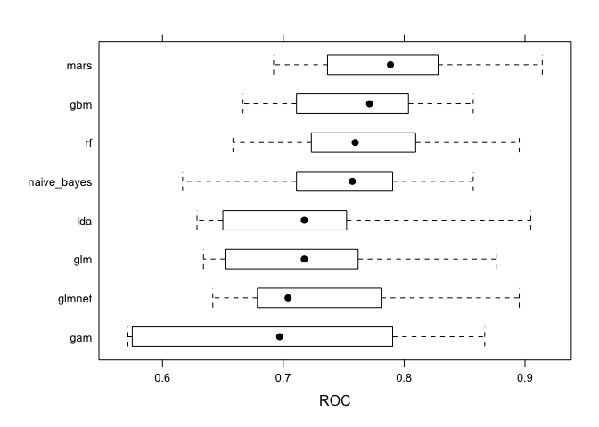<!-- -->

``` r
res = resamples(list(glm = logit_fit_1, svml = svml_fit, svmr = svmr.fit))
summary(res)
```

    ## 
    ## Call:
    ## summary.resamples(object = res)
    ## 
    ## Models: glm, svml, svmr 
    ## Number of resamples: 10 
    ## 
    ## Accuracy 
    ##           Min.   1st Qu.    Median      Mean   3rd Qu.      Max. NA's
    ## glm  0.6086957 0.6988225 0.7272727 0.7206357 0.7361660 0.8181818    0
    ## svml 0.6521739 0.7130682 0.7332016 0.7338768 0.7643281 0.8181818    0
    ## svmr 0.6363636 0.6988225 0.7332016 0.7429677 0.8068182 0.8181818    0
    ## 
    ## Kappa 
    ##             Min.   1st Qu.    Median      Mean   3rd Qu.      Max. NA's
    ## glm   0.17204301 0.2016796 0.2807286 0.2983365 0.3526242 0.5463918    0
    ## svml  0.17204301 0.2695778 0.3210841 0.3212596 0.3472302 0.5056180    0
    ## svmr -0.08641975 0.2529788 0.3128055 0.3121639 0.4930749 0.5056180    0

## Logistic Regression on different follow-up time

``` r
heart_group = 
  heart_tb %>% 
  mutate(time = factor(case_when(time < 100 ~ 1, 
                          TRUE ~ 2)))


heart_group$creatinine_phosphokinase = as.numeric(heart_group$creatinine_phosphokinase)
heart_group$ejection_fraction = as.numeric(heart_group$ejection_fraction)
heart_group$serum_sodium = as.numeric(heart_group$serum_sodium)
heart_group$death_event = factor(ifelse(heart_group$death_event == 1, "dead", "alive"))

group1 = heart_group %>% filter(time == 1)
group1 = as.data.frame(group1[,-12])
x1 = model.matrix(death_event~., group1)[, -1]
y1 = group1$death_event

heart_group %>% filter(time == 1) %>% 
  group_by(death_event) %>% 
  summarise(count = n())
```

    ## # A tibble: 2 × 2
    ##   death_event count
    ##   <fct>       <int>
    ## 1 alive          55
    ## 2 dead           71

``` r
group2 = heart_group %>% filter(time == 2)
group2_alive = group2 %>% filter(death_event == "alive")
set.seed(1)
sp = sample(nrow(group2_alive), 25)
group2_sp = rbind(group2_alive[sp, ], group2 %>% filter(death_event == "dead"))

group2_sp = as.data.frame(group2_sp[,-12])
x2 = model.matrix(death_event~., group2_sp)[, -1]
y2 = group2_sp$death_event


# follow-up time < 100 days - group 1
set.seed(1)
logit_fit_tm = train(x1, y1, 
                  method = "glm", 
                  metric = "ROC", 
                  trControl = ctrl_1)

summary(logit_fit_tm)
```

    ## 
    ## Call:
    ## NULL
    ## 
    ## Deviance Residuals: 
    ##     Min       1Q   Median       3Q      Max  
    ## -1.8574  -0.8948   0.3252   0.8806   2.1362  
    ## 
    ## Coefficients:
    ##                            Estimate Std. Error z value Pr(>|z|)    
    ## (Intercept)               1.343e+01  7.596e+00   1.768 0.077022 .  
    ## age                       5.706e-02  2.021e-02   2.824 0.004745 ** 
    ## anaemia1                  1.233e-01  4.830e-01   0.255 0.798518    
    ## creatinine_phosphokinase  2.692e-04  1.977e-04   1.361 0.173365    
    ## diabetes1                 8.751e-02  4.463e-01   0.196 0.844565    
    ## ejection_fraction        -6.513e-02  1.888e-02  -3.449 0.000562 ***
    ## high_blood_pressure1      7.581e-02  4.553e-01   0.167 0.867748    
    ## platelets                 5.713e-07  2.154e-06   0.265 0.790808    
    ## serum_creatinine          7.249e-01  3.389e-01   2.139 0.032435 *  
    ## serum_sodium             -1.135e-01  5.407e-02  -2.098 0.035881 *  
    ## sex1                     -5.430e-01  5.389e-01  -1.008 0.313598    
    ## smoking1                  3.552e-01  5.296e-01   0.671 0.502398    
    ## ---
    ## Signif. codes:  0 '***' 0.001 '**' 0.01 '*' 0.05 '.' 0.1 ' ' 1
    ## 
    ## (Dispersion parameter for binomial family taken to be 1)
    ## 
    ##     Null deviance: 172.64  on 125  degrees of freedom
    ## Residual deviance: 129.89  on 114  degrees of freedom
    ## AIC: 153.89
    ## 
    ## Number of Fisher Scoring iterations: 5

``` r
vip(logit_fit_tm)
```

<!-- -->

``` r
# follow-up time ~ >100 days - group 2
set.seed(1)
logit_fit_tm2 = train(x2, y2, 
                  method = "glm", 
                  metric = "ROC", 
                  trControl = ctrl_1)
```

    ## Warning: glm.fit: fitted probabilities numerically 0 or 1 occurred

    ## Warning: glm.fit: fitted probabilities numerically 0 or 1 occurred

    ## Warning: glm.fit: fitted probabilities numerically 0 or 1 occurred

    ## Warning: glm.fit: algorithm did not converge

    ## Warning: glm.fit: fitted probabilities numerically 0 or 1 occurred

    ## Warning: glm.fit: fitted probabilities numerically 0 or 1 occurred

    ## Warning: glm.fit: fitted probabilities numerically 0 or 1 occurred

    ## Warning: glm.fit: fitted probabilities numerically 0 or 1 occurred

``` r
summary(logit_fit_tm2)
```

    ## 
    ## Call:
    ## NULL
    ## 
    ## Deviance Residuals: 
    ##      Min        1Q    Median        3Q       Max  
    ## -1.54884  -0.44000  -0.00525   0.28665   3.02538  
    ## 
    ## Coefficients:
    ##                            Estimate Std. Error z value Pr(>|z|)  
    ## (Intercept)               1.571e+01  2.654e+01   0.592   0.5538  
    ## age                       3.014e-02  6.019e-02   0.501   0.6166  
    ## anaemia1                  8.861e-01  1.259e+00   0.704   0.4815  
    ## creatinine_phosphokinase  1.175e-03  7.659e-04   1.534   0.1251  
    ## diabetes1                -1.248e-01  1.216e+00  -0.103   0.9182  
    ## ejection_fraction        -2.033e-01  1.068e-01  -1.904   0.0569 .
    ## high_blood_pressure1     -1.430e+00  1.976e+00  -0.724   0.4691  
    ## platelets                -8.569e-06  6.963e-06  -1.231   0.2184  
    ## serum_creatinine          5.112e+00  2.361e+00   2.165   0.0304 *
    ## serum_sodium             -1.049e-01  1.819e-01  -0.577   0.5641  
    ## sex1                     -1.373e+00  1.808e+00  -0.760   0.4475  
    ## smoking1                 -4.419e-01  1.285e+00  -0.344   0.7310  
    ## ---
    ## Signif. codes:  0 '***' 0.001 '**' 0.01 '*' 0.05 '.' 0.1 ' ' 1
    ## 
    ## (Dispersion parameter for binomial family taken to be 1)
    ## 
    ##     Null deviance: 69.315  on 49  degrees of freedom
    ## Residual deviance: 28.605  on 38  degrees of freedom
    ## AIC: 52.605
    ## 
    ## Number of Fisher Scoring iterations: 8

``` r
vip(logit_fit_tm2)
```

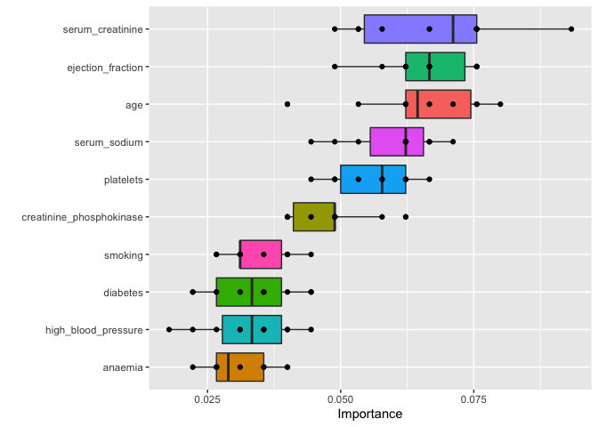<!-- -->
